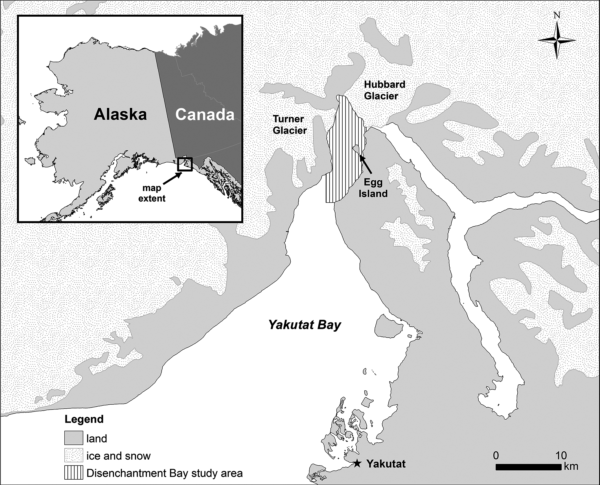
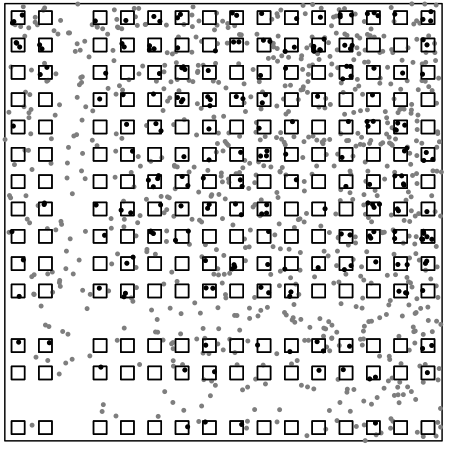
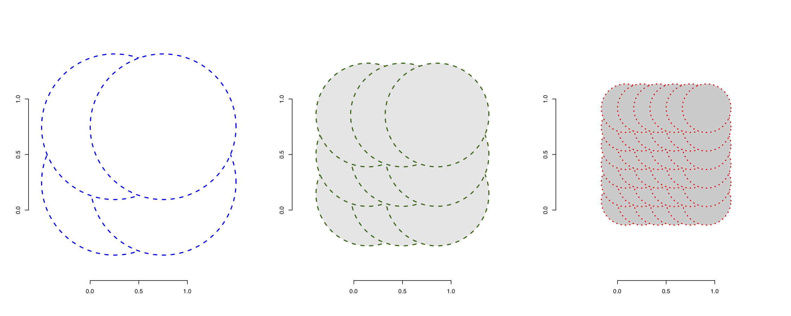
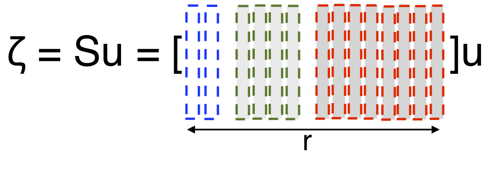

# Download the R Studio project from github
You can access this document, the R code, and the data used in this workshop by downloading my R Studio project. It's located at `https://github.com/wrbrooks/seals`.

### Import some functions
We'll use some auxiliary functions and ggplot2 for plotting.
```{r}
source("R/auxiliary-functions.R")
require(ggplot2)
```

# Problem
The National Marine Mammal Laboratory is tasked with tracking the population of harbor seals in the wild. One tool is the use of aerial photography. Disenchantment Bay is a tidewater glacial fjord in Southeast Alaska with a significant population of harbor seals. Our goal is to estimate the total population of harbor seals in Disenchantment Bay.


 

source: Jansen et al. (2015)

We're going to model the locations of seals as a Poisson point process, meaning that in any unit of area, the number of seals follows a Poisson distribution. The estimate is to be based on aerial images that cover part of the bay, and we will use smoothing to fill in the unobserved areas. We will use a spatial basis function approach to make the density of the Poisson process spatially varying.



source: Jansen and Ver Hoef (2014)


# Data 
A small small airplane made several transects over the bay, taking photos straight down at 100m intervals, where each photo covers an area of 80m x 120m. The photos don't overlap and the transects are spaced far enough apart that no seal should be photographed twice. The seals in each photograph were counted by hand. Since the transects only cover a portion of the bay, we will have to make a model and estimate the total seal population based on the observed images.

Let's import the data. `seal_locs` is a list of locations where a seal was observed, `photo_sites` is the center point of each aerial photograph, and `pred` is a raster of the study area. We'll be predicting the density of seals within each 53m x 53m cell of `predict`.

A raster is a way of saying the region has been broken up into little pieces (like pixels on a screen). We will assume that the density of seals is constant within each cell of the raster, which makes it easy to integrate the density over the whole bay - just add up the values of each raster cell.

```{r}
seal_locs <- read.csv("data/dbay_20040622_seal_locs.csv")
pred <- read.csv("data/20040622_nonpup_predict.csv")
photo_sites <- read.csv("data/photo_sites.csv")
```

Now we can plot the data. The red squares are photo sites and the black circles are seal locations.

```{r}
plot(pred$x, pred$y, col='grey70', bty='n', xlab="Easting (m)", ylab="Northing (m)", pch=15)
points(seal_locs[,c('ET_X', 'ET_Y')])
points(photo_sites, col='red', pch=22)
```

We can see that the photos aren't quite aligned with the seal locations, but we will just snap each seal to the nearest photograph:

```{r}
# Each photo is a bin. We will put each seal into the nearest bin, and keep count of how many seals are in each.
seal_counts <- rep(0, nrow(photo_sites))
for (i in 1:nrow(seal_locs)) {
  photo_dist <- apply(photo_sites, 1, function(s) (s[1] - seal_locs$ET_X[i])**2 +
                        (s[2] - seal_locs$ET_Y[i])**2 )
  seal_counts[which.min(photo_dist)] <- seal_counts[which.min(photo_dist)] + 1
}
```


# Smoothing with spatial basis functions
We use spatial basis functions to smooth the density of seals over the whole of Disenchantment Bay, which allows us to predict the number of seals that weren't observed in the aerial photos.


The idea of spatial basis functions is to cover a spatial region with several local functions that can be independently adjusted to find the overall function that best fits the data. A simple example is a checkerboard pattern where the spatial function takes a constant value within each square, but different squares have different values. Our method is only a little more complicated.

We span the study area with Gaussian functions of two resolutions: coarse and fine. We will estimate a coefficient $u$ for each Gaussian, as indicated in the figure.





Each of the Gaussians is a spatial basis function, and its center point is called a knot. We want the knot locations to cover the whole domain but always to have at least one observed seal within their range. For now, let's import the knot locations that I chose in advance. The knot locations are plotted below.

```{r}
grid_coarse <- read.csv("data/grid_coarse.csv")
grid_med <- read.csv("data/grid_med.csv")
```

```{r}
plot(pred$x, pred$y, col='grey70', bty='n', xlab="Easting (m)", ylab="Northing (m)", pch=15)
points(grid_coarse, col='green', pch=15)
points(grid_med, col='blue', pch=15)
```

## Set up the model matrices
We now set the bandwidth parameters for the coarse and fine basis functions, and then create the basis expansion. We create the expansion by evaluating each basis function at each photo site. The bandwidth parameters here were somewhat arbitrary - you can adjust them if you like and see how it affects the result. The effect of changes in the knot locations and bandwidth parameters is often surprisingly small (because the model is always attempting to use its inputs to match the observed data).

```{r}
# set the bandwidths (here called 'r' for range)
r_coarse <- 2000 
r_med <- 800

# Set up spatial basis function model matrices:
coarse_mm <- t(apply_basis(photo_sites, grid_coarse, r_coarse, gaussian))
med_mm <- t(apply_basis(photo_sites, grid_med, r_med, gaussian))

# create the total model matrix
basis <- as.data.frame(coarse_mm)
basis <- cbind(basis, med_mm)
names(basis) <- paste0("X", 1:ncol(basis))
```
## Estimation
Now we are ready to estimate the model. We use a Poisson regression on the counts in each photo. Since every photo covers the same size area, there's no need to worry about weights here. Note that we are able to estimate the coefficients of the basis functions using just the observed counts in the photos. Once the coefficients are estimated, they will allow us to predict the density of seals anywhere in the bay. 

```{r}
basis$cnt <- seal_counts
seal_density_model <- glm(cnt ~ ., family='poisson', data=basis)
```

## Prediction
And finally we predict the seal density in the raster cells. Here we have to account for the raster cells being 53m x 53m, smaller than the photos which are each 120m x 80m. 

```{r}
# evaluate the basis functions at each location
coarse_pm <- t(apply_basis(pred[,1:2], grid_coarse, r_coarse, gaussian))
med_pm <- t(apply_basis(pred[,1:2], grid_med, r_med, gaussian))

# create the predictive model matrix
X_pred <- data.frame(coarse_pm)
X_pred <- cbind(X_pred, med_pm)
names(X_pred) <- paste0("X", 1:ncol(X_pred))

# make predictions and sum them up
link_pred <- predict(seal_density_model, X_pred)
popest <- sum(0.053 * 0.053 / (0.12 * 0.08) * exp(link_pred))
```
The estimated population of seals in the bay is `r round(popest, 1)`. We can also visualize the predicted density of seals. This plot seems to match the observed seal pattern quite well.

```{r}
ggdf <- pred
ggdf$fit <- link_pred
ggplot(ggdf) + aes(x=x,y=y, color=exp(fit)) + geom_point()
```

# Variance estimate
Estimating the variance is a bit more complicated. See Jansen and Ver Hoef (2014) for complete details. 

First, we estimate an oversidpersion parameter because the variance of the residuals appears to be greater than is assumed by the Poisson model. The overdispersion will multiply the overall standard error estimate.

```{r}
# estimate the overdispersion parameter
over_dispersion <- mean(residuals(seal_density_model, type='pearson')[predict(seal_density_model) >
                                                                          quantile(predict(seal_density_model), 0.75)]**2)
```

Next, we calculate the covariance matrix of the coefficients. This is like the familiar $(X^T X)^{-1}$ of linear regression, except that each row of X is scaled by its unique standard error estimate (which arises from the Poisson GLM).

```{r}
# Approximate the covariance matrix of the coefficients
smm <- model.matrix(seal_density_model)
precision <- matrix(0, ncol(smm), ncol(smm))
for (i in 1:nrow(smm)) {
  precision <- precision + smm[i,] %*% t(smm[i,]) * fitted.values(seal_density_model)[i] 
}
precision <- precision * 0.08 * 0.12 #scale for the size of the cells
A <- solve(precision)
```

Now we use the uncertainty in the coefficient estimates to calculate uncertainty in the predictions of each raster cell, and sum them up.

```{r}
# compute the prediction standard error that comes from uncertainty in the coefficient estimates
cc <- colSums(apply(cbind(1, X_pred), 2, function(c) c * exp(link_pred))) * 
  (nrow(pred) * 0.053 * 0.053 - nrow(basis * 0.080 * 0.120)) / nrow(pred)
pred_var <- (t(as.matrix(cc)) %*% A %*% as.matrix(cc))
```

Finally, include the uncertainty arising from the assumption of a Poisson distribution of counts.

```{r}
# Compute the standard error coming from the Poisson assumption.
# Note that w have to adjust for the different sizes of the photos from the raster cells.
pois_var <- (sum(0.053*0.053 / 0.12/0.08*exp(link_pred)) - sum(basis$cnt))

# Compute the overall standard error of our estimate:
total_std_err <- over_dispersion * sqrt(pred_var + pois_var)
```
The standard error of the population estimate is `r round(total_std_err, 0)`.


# References

Jansen JK, Brady GM, Ver Hoef JM, Boveng PL (2015) "Spatially Estimating Disturbance of Harbor Seals (*Phoca vitulina*)". PLoS ONE 10(7): e0129798. https://doi.org/10.1371/journal.pone.0129798

Jansen JK, Ver Hoef JM (2014) "Estimating Abundance from Counts in Large Data Sets of Irregularly-Spaced Plots using Spatial Basis Functions". arXiv Preprint 1410.3163. https://arxiv.org/abs/1410.3163
